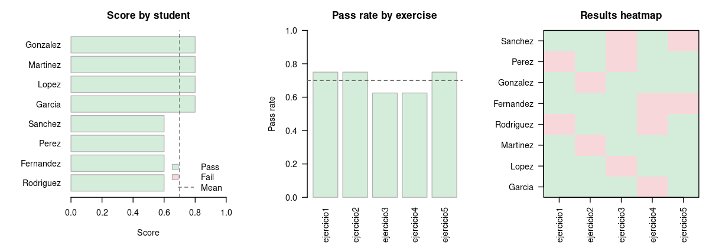

# corrector

[Versión en español](README.md)

An R package for automatically grading student coding exercises. Each student
submits one R file per exercise; the professor provides matching test files. The
package sources both into an isolated environment, runs the tests, and returns a
tidy data frame of results.

## Installation

```r
# install.packages("remotes")
remotes::install_github("your-github-username/corrector")
```

## Minimal end-to-end example

```r
library(corrector)

# --- 1. Create a fake submission folder ---
dir.create("submissions/garcia", recursive = TRUE)
dir.create("submissions/lopez",  recursive = TRUE)
dir.create("tests")

writeLines(
  'ceros_cuadratica <- function(a, b, c) {
     d <- b^2 - 4*a*c
     c((-b - sqrt(d)) / (2*a), (-b + sqrt(d)) / (2*a))
   }',
  "submissions/garcia/ejercicio1.R"
)

writeLines(
  'ceros_cuadratica <- function(a, b, c) c(0, 0)',  # wrong
  "submissions/lopez/ejercicio1.R"
)

writeLines(
  'test_ejercicio1_raices <- function() {
     all(ceros_cuadratica(1, 0, -1) == c(-1, 1))
   }
   test_ejercicio1_tipo <- function() {
     is.numeric(ceros_cuadratica(1, 0, -1))
   }',
  "tests/test_ejercicio1.R"
)

# --- 2. Grade ---
results <- grade_submissions("submissions/", test_dir = "tests/")
#   student    ejercicio1
# 1 Garcia          TRUE
# 2 Lopez          FALSE

# --- 3. Summarise and export ---
grade_report(results)
export_to_html(results, "report.html")
export_to_csv(results,  "grades.csv")
```

A built-in sample dataset is available to try the package immediately:

```r
results <- example_results()  # 8 fake students, 5 exercises
grade_report(results)
plot_report(results)
```

## How it works

The grader follows a naming convention:

```
submissions/
├── garcia_juan/
│   ├── ejercicio1.R   <- student file
│   └── ejercicio2.R
└── lopez_maria/
    ├── ejercicio1.R
    └── ejercicio2.R

tests/
├── test_ejercicio1.R  <- professor test file (name must match)
└── test_ejercicio2.R
```

Each test file contains functions named `test_<exercise>_<case>` that return
`TRUE` or `FALSE`:

```r
# tests/test_ejercicio1.R
test_ejercicio1_positivos <- function() {
  all(ceros_cuadratica(1, 0, -1) == c(-1, 1))
}

test_ejercicio1_tipo <- function() {
  is.numeric(ceros_cuadratica(1, 0, -1))
}
```

Student code and test code are sourced into a fresh, isolated environment for
each exercise, so submissions cannot interfere with each other.

## Usage

```r
library(corrector)

# Grade a full batch (directory or .zip)
results <- grade_submissions("submissions/", test_dir = "tests/")

# Grade a single file during development
grade_exercise("submissions/garcia_juan/ejercicio1.R", test_dir = "tests/")

# Console summary
grade_report(results)

# Export
export_to_csv(results, "grades.csv")
export_to_html(results, "report.html")

# Export to Google Sheets (requires googlesheets4)
googlesheets4::gs4_auth()
export_to_sheets(results, "https://docs.google.com/spreadsheets/d/...")
```

## Plots

`plot_report()` produces three sequential plots: student scores ranked,
pass rate per exercise, and a pass/fail heatmap.

```r
# Interactive, pauses between plots
plot_report(results)

# Save to PDF
pdf("report.pdf", width = 8, height = 5)
plot_report(results, ask = FALSE)
dev.off()
```



## Timeout

```r
results <- grade_submissions("submissions/", test_dir = "tests/", timeout = 10)
```

Tests that exceed the limit are recorded as `FALSE`.

## Example test files

```r
system.file("examples", package = "corrector")
```

## Alternatives

- **[gradethis](https://pkgs.rstudio.com/gradethis/)**: grades code inside
  interactive [learnr](https://rstudio.github.io/learnr/) tutorials. Requires a
  Shiny server.
- **[exams](https://www.r-exams.org/)**: generates randomised exam questions,
  exports to Moodle, Canvas, PDF and more.
- **[RTutor](https://github.com/skranz/RTutor)**: Shiny-based interactive
  problem sets with automatic solution checking.

corrector is the lightest option: no server, plain `.R` file submissions,
zero hard dependencies.

## Contributing

Feedback is welcome. Open an issue on GitHub.
